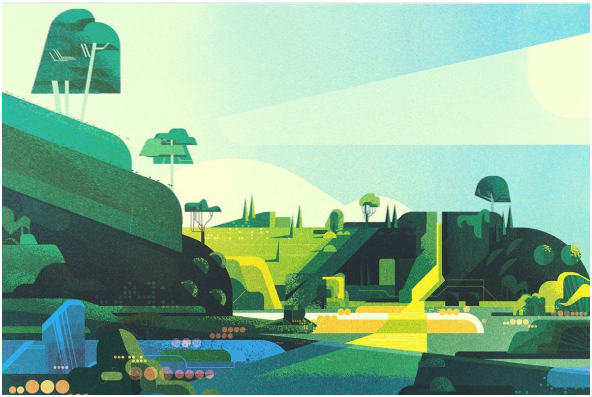
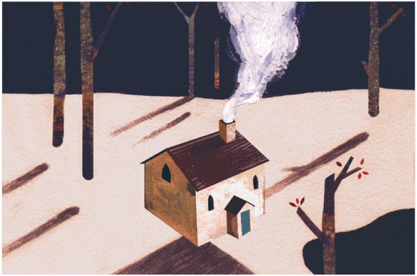

<div align="center">

```
     ╔══════════════════════════╗
     ║      ╱▔▔╲      ╱▔▔╲     ║
     ║     ╱    ╲    ╱    ╲    ║
     ║    ╱  ◕   ╲╱   ◕  ╲   ║
     ║    │       ○       │    ║
     ║    │    ╔═══╗     │    ║
     ║    ╲    ║ ♥ ║    ╱    ║
     ║     ╲   ╚═╤═╝   ╱     ║
     ║      ╲    │    ╱      ║
     ║       ╲   │   ╱       ║
     ║        ╲  │  ╱        ║
     ║         ╲ │ ╱         ║
     ║          ╲│╱          ║
     ║       ～(◕‿◕)～       ║
     ║                       ║
     ║      🧠 Mindmate      ║
     ║  "Belajar dengan      ║
     ║   Menyenangkan"       ║
     ╚══════════════════════════╝
              🧩  🧩
```

  <h1>🧠 Mindmate</h1>
  <p><strong>Belajar dengan Menyenangkan</strong></p>

  <p>
    
    
    
    
    
  </p>

  <br />
</div>

## ✨ Tentang Mindmate

```
             ╱▔▔╲
            ╱    ╲
           ╱  ◕‿◕  ╲
           │   ♥   │
            ╲     ╱
             ╲   ╱
              ╲ ╱
               ○
           ────╥────
           ╱   ║   ╲
          ╱    ║    ╲
         ╱  🧠 ║ 🧩  ╲
        │       │      │
         ╲     ╱╲     ╱
          ╲   ╱  ╲   ╱
           ╲ ╱    ╲ ╱
```

  "Ayo belajar!"

**Mindmate** adalah aplikasi produktivitas harian yang dirancang khusus untuk membantu kamu tetap konsisten dalam belajar dan menyelesaikan tugas-tugas harian. Dengan pendekatan gamifikasi, setiap tugas yang kamu selesaikan akan memberikan hadiah koin dan potongan puzzle yang bisa dikumpulkan!

> 🎯 "Jadikan belajar sebagai kebiasaan, bukan kewajiban."

---

## 🚀 Fitur Unggulan

### 📋 Daily Task Manager
Atur 6 tugas harianmu dengan target yang jelas. Checklist sederhana untuk melacak progres harian.

### 🔥 Streak Tracker
Pertahankan konsistensi! Setiap hari kamu menyelesaikan semua tugas, streak-mu bertambah. Jangan sampai putus!

### 🧩 Puzzle Collection
Setiap streak harian memberikan 1 potongan puzzle. Kumpulkan 7 puzzle unik selama seminggu penuh:
- 🏠 Winter Cabin
- 🏡 Lakeside Modern
- 🌲 Misty Pine Forest
- ⛰️ Purple Peaks
- 🏔️ Ice River Valley
- 🌿 Spring Meadow
- 🎈 Balloon Festival

### 🪙 Coin Economy
Setiap tugas selesai memberimu koin yang bisa ditukar untuk membuka puzzle atau reward lainnya.

### 😊 Mood Tracker
Catat suasana hatimu setiap hari dan lihat pola produktivitasmu.

### 📊 Weekly Insights
Pantau statistik mingguan — berapa tugas selesai, koin terkumpul, dan streak terbanyak.

### 🧘 Relax Mode
Butuh istirahat? Timer relaksasi built-in untuk membantu kamu re-charge.

### 📝 Catatan & Catatan Harian
Fitur notes untuk mencatat ide, jurnal harian, atau hal penting lainnya.

---

## 🖼️ Screenshots

| Home | Puzzle Collection | Insights |
|:---:|:---:|:---:|
|  |  |  |

---

## 🛠️ Tech Stack

<table>
  <tr>
    <td align="center"><b>Framework</b></td>
    <td>Flutter 3.10+</td>
  </tr>
  <tr>
    <td align="center"><b>Language</b></td>
    <td>Dart</td>
  </tr>
  <tr>
    <td align="center"><b>State Management</b></td>
    <td>Flutter BLoC (Cubit)</td>
  </tr>
  <tr>
    <td align="center"><b>Local Database</b></td>
    <td>Hive, SharedPreferences</td>
  </tr>
  <tr>
    <td align="center"><b>Networking</b></td>
    <td>HTTP (ApiClient)</td>
  </tr>
  <tr>
    <td align="center"><b>Animations</b></td>
    <td>Lottie, CustomPainter</td>
  </tr>
</table>

### 📦 Dependencies

| Package | Kegunaan |
|---------|----------|
| `flutter_bloc` | State management |
| `equatable` | Value equality untuk BLoC states |
| `hive` + `hive_flutter` | Local NoSQL database |
| `shared_preferences` | Key-value storage ringan |
| `lottie` | Animasi JSON Lottie |
| `intl` | Format tanggal & angka |
| `uuid` | Generate ID unik |
| `http` | REST API client |
| `image_picker` | Pilih foto profil dari galeri |
| `url_launcher` | Buka link eksternal |

---

## 🏗️ Struktur Project

```
lib/
├── bloc/               # Business Logic Components (BLoC)
│   ├── auth/           #   Autentikasi
│   ├── task/           #   Manajemen tugas
│   └── profile/        #   Profil & puzzle
├── config/             # Konfigurasi (theme, route)
├── models/             # Data models
├── networks/           # API client & config
├── screens/            # UI Screens
│   ├── auth/           #   Login, Signup, etc.
│   ├── home/           #   Home (task list, puzzle)
│   ├── insights/       #   Statistik mingguan
│   ├── onboarding/     #   Splash & onboarding
│   ├── profile/        #   Profil, puzzle collection
│   ├── relax/          #   Relax timer
│   ├── settings/       #   Settings
│   └── tasks/          #   Add task, notes
├── utils/              # Constants & helpers
└── widgets/            # Reusable widgets
```

---

## 🎮 Cara Bermain

```
          Mulai 🏁
             │
             ▼
   ┌──────────────────┐
   │ ✏️ Buat 6 tugas   │
   └─────────┬────────┘
             │
             ▼
   ┌──────────────────┐
   │ ✅ Selesaikan     │ ◀── 🪙 Dapat koin!
   │    tugas harian   │
   └─────────┬────────┘
             │
      ╔══    ▼    ══╗
      ║  🔥 Streak!  ║ ─── 🧩 Puzzle +1
      ╚══════════════╝
             │
             ▼
   ┌──────────────────┐
   │ 🏆 7 hari =      │
   │    Koleksi       │
   │    Puzzle Lengkap│
   └──────────────────┘
      ╱▔╲      ╱▔╲
     ╱   ╲    ╱   ╲
    ╱  ◕  ╲  ╱  ◕  ╲
    │     ○○     │
     ╲    ♥    ╱
      ╲  ╯╰  ╱
       ╲    ╱
        ╲  ╱
      (◕‿◕)つ
```

1. **Buat tugas** — Tambahkan hingga 6 tugas harianmu
2. **Selesaikan satu per satu** — Centang tugas yang selesai ✅
3. **Kumpulkan koin** — Setiap tugas memberi koin 🪙
4. **Jaga streak** — Selesaikan 6 tugas untuk streak harian 🔥
5. **Dapatkan puzzle** — Setiap streak = 1 puzzle unik 🧩
6. **Koleksi lengkap** — 7 puzzle dalam 7 hari!

---

## 🚀 Memulai

```bash
# Clone repository
git clone https://github.com/username/mindmate.git
cd mindmate

# Install dependencies
flutter pub get

# Generate Hive adapters (jika ada perubahan model)
flutter pub run build_runner build

# Jalankan aplikasi
flutter run
```

> ⚠️ **Catatan:** Aplikasi ini membutuhkan backend server untuk fitur autentikasi dan sync data. Pastikan API endpoint sudah dikonfigurasi di `lib/networks/api_config.dart`.

---

## 🤝 Kontribusi

Kontribusi selalu diterima dengan tangan terbuka! Silakan buka *issue* atau kirim *pull request* untuk perbaikan atau fitur baru.

1. Fork repository ini
2. Buat branch baru (`git checkout -b feature/fitur-keren`)
3. Commit perubahan (`git commit -m 'feat: tambah fitur keren'`)
4. Push ke branch (`git push origin feature/fitur-keren`)
5. Buka Pull Request

---

<div align="center">

```
       ╱▔▔▔▔▔▔╲
      ╱         ╲
     ╱    ◕‿◕    ╲
     │    ♥ ♥    │
     │   ╔═══╗   │
      ╲  ║ ♥ ║  ╱
       ╲ ╚═╤═╝ ╱
        ╲  │  ╱
         ╲ │ ╱
          ╲│╱
       ～(◕‿◕)～
```

  <p>Dibuat dengan ❤️ menggunakan Flutter & Dart</p>
  <p>
    <i>"Jadikan belajar sebagai kebiasaan, bukan kewajiban"</i>
  </p>
  <br />
  <p>
    <a href="#">Privacy Policy</a> •
    <a href="#">Terms of Service</a> •
    <a href="#">Contact</a>
  </p>
</div>
